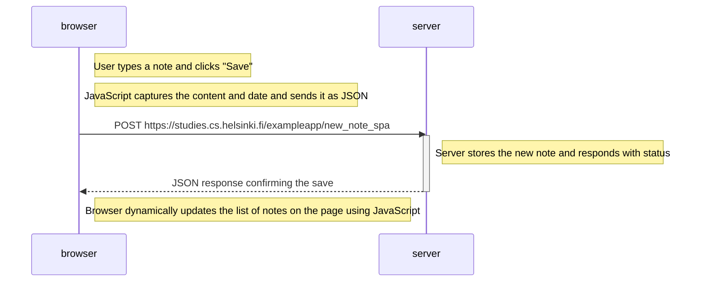

```mermaid
sequenceDiagram

participant browser
participant server

Note right of browser: User types a note and clicks "Save"

Note right of browser: JavaScript captures the content and date and sends it as JSON

browser->>server: POST https://studies.cs.helsinki.fi/exampleapp/new_note_spa
activate server
Note right of server: Server stores the new note and responds with status
server-->>browser: JSON response confirming the save
deactivate server

Note right of browser: Browser dynamically updates the list of notes on the page using JavaScript

```
